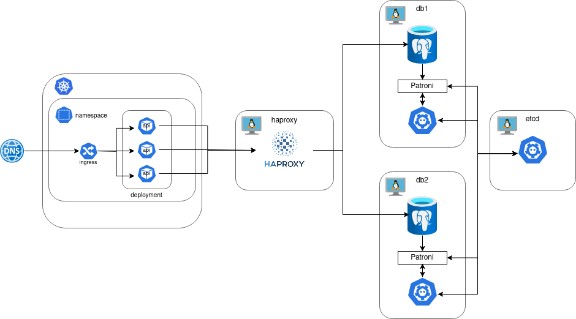
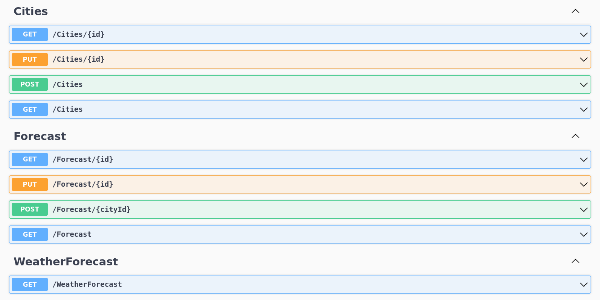
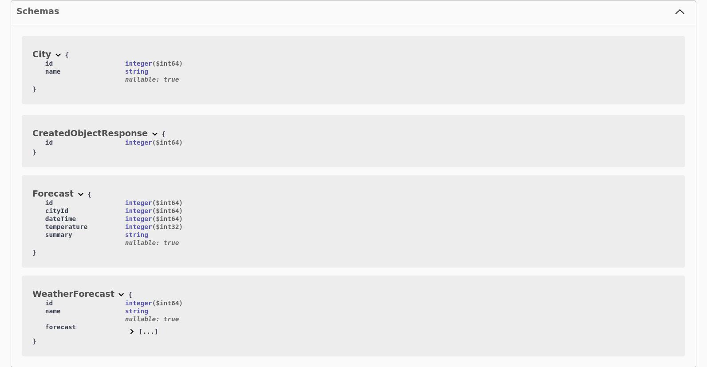

## WeatherApi
API прогноза погоды, располагающийся в кластере Kubernetes и обращающийся к отказоустойчивому кластеру Postgres через балансировщик HAProxy (см. схему ниже).

Директория ```weather-api``` — Helm чарт для развёртывания api в Kubernetes.

Домен для доступа к api:  ```weather-api-94``` (указать заголовок ```Host: weather-api-94``` при запросе).

```postgresql_cluster @ 06a8bf7``` — ссылка на репозиторий с плейбуком и ролями Ansible для развёртывания кластера Postgres.



### Эндпоинты и данные



